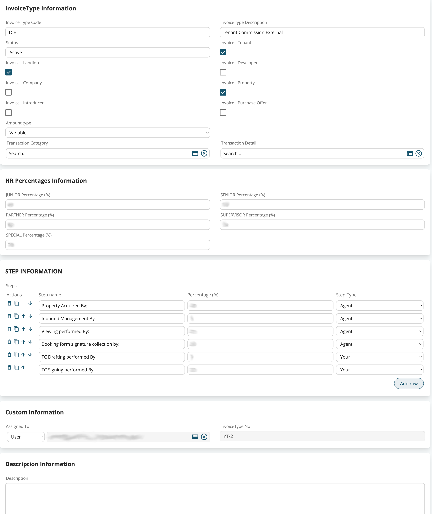

# Module Process Settings

This module is a generic template for the business pattern where we need to associate to a record a set of configuration options for additional work that needs to be done. A typical example is the commission rules that need to be applied to an invoice. Depending on the type of invoice and the people who participate in the sale we can have different commission settings, so we define a module where we save all the different commission distributions that we can have and then relate the correct record with each invoice when it is created. Later, a post-process can read these settings and set up the necessary records for payments and accounting.

So this would be a module where we could define any combination of settings that any invoice type may need. This idea can be extended to any other module, like Potentials where we could define different patterns of calling and following up on each business opportunity based on any conditions we may require.

Defined in this way the business pattern doesn't sound very exciting. You can already do this in many ways inside coreBOS. You can use workflows, custom functions, hooks, business actions, ...

This pattern brings a few additional features with it that could make it an interesting option in some cases, albeit I have to admit that I don't quite see it, but I'm not UI/UX oriented at all :-)

This module has some fields that must be present with the exact names they are defined within this template. These fields:

- the module the settings are for
- the field filter map that can be applied
- the field dependency map that can be applied
- the validation map that can be applied
- an active checkbox to mark the settings are active or not

and that is where the extra functionality of this pattern appears. coreBOS is capable of finding the correct setting record to apply on each main record, either directly from a field dependency map or through a business rule, and then automatically reload the screen applying the defined maps to make the user experience more adapted to each type of record.

In the video you can see below I try to explain what this may look like for the Invoice module.

## Installation and Configuration

As a template module, you should download this code and adapt it to your needs. It currently contains only the mandatory fields, and no settings. So, I would recommend you follow these steps to use this module

- fork the repo into your new configuration module
- rename the module to make it clear for which module it is, the "module" prefix here is just a placeholder
  - let's suppose you need a configuration module for Invoice, so we change the name of the module to "InvoiceProcessSettings"
  - change the name of the directory `mv ModuleProcessSettings InvoiceProcessSettings`
  - change the name of the main module files `rename "s/ModuleProcessSettings/InvoiceProcessSettings/g" ModuleProcessSettings*`
  - edit InvoiceProcessSettings.php and change the module name and main table
  - edit manifest.xml and make the same rename
- in the manifest.xml add the fields you need for your settings, any set of fields that your business requirements need. This is the part where this module makes "sense". If you have a lot of configuration options for your business process, here you are creating a module to save all of those settings
- in `InvoiceProcessSettings.php`, vtlib_handler method, change the [related module variable](https://github.com/coreBOS/ModuleProcessSettings/blob/main/modules/ModuleProcessSettings/ModuleProcessSettings.php#L132)
- change the install* files accordingly

Now you should be able to install the module by copying the install XML changeset to modules/cbupdater/cbupdates and you can start creating the necessary business maps and configuration records and all the custom logic you need to actually use the fields in the settings module.

This is an example of the fields and information this module could end up having:

## Triggering the selection of the settings record

Relating the correct Settings record to the main record can be done using workflows, but the goal of this development is to do it dynamically when the user selects the type of the main record. To accomplish this we can use a Field Dependency map that calls the `fieldDep_LoadSettings` function. This function expects one parameter which can be the CRMID of the correct settings record to relate or the CRMID of a business map that will be evaluated to get the correct settings record ID. This permits us to use even a decision table if we needed to.

In the `test` directory you can find the field dependency map I used for the example.
